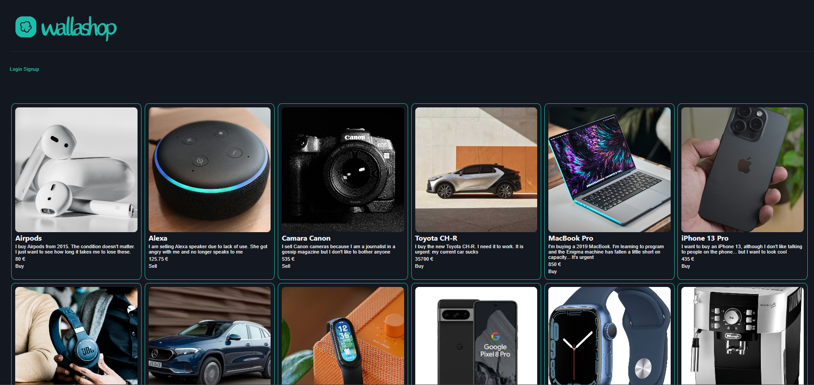
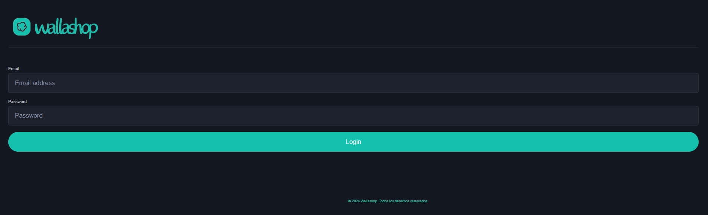
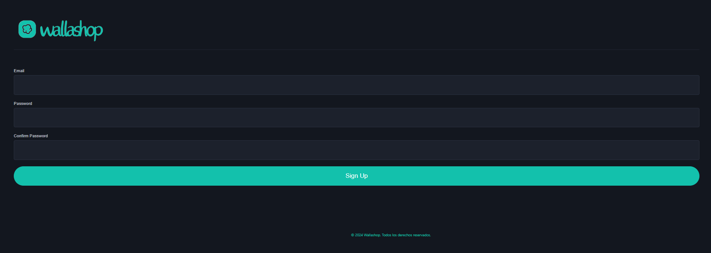
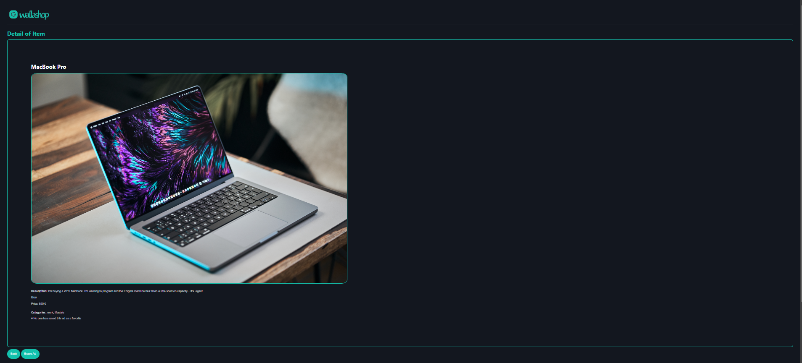
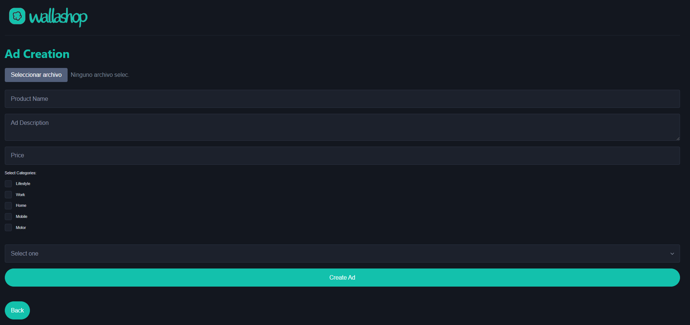

# Wallashop
Aplicación similar Wallapop para la práctica de Frontend con Javascript || Bootcamp Desarrollo Web

## Description
Wallashop is a web application for buying and selling second-hand items. It uses Sparrest as a database to store ad information and allows registered users to create, view, and delete their own ads.

## Features v.1
**User Registration**: Users can register on the platform by providing their email and a password.

**Login**: Registered users can log in to the platform using their email and password.

**Ad Creation**: Users can create ads to sell second-hand items. They can provide information such as the product name, description, price, categories, and photos.

**Viewing Ads**: Users can see a list of ads available on the platform. Each ad displays its name, description, price, and associated categories.

**Ad Detail**: Users can click on an ad to view more details, including additional information such as the number of favorites, and have the option to delete the ad if they are the owner.

**Ad Search**: The application allows users to search for ads by name, type of operation (buy or sell), and categories. (Next impllementation)

**Notifications**: Real-time notifications are displayed to inform the user about important events, such as errors loading ads or warnings about internet connection.

## How to Launch the Application
**Clone the Repository:**
Clone the Wallashop repository from GitHub to your local machine.

**Install Dependencies:**
Install the necessary dependencies using your preferred package manager. You can do this by running `npm install` in the project directory.

**Set up the Database:**
Set up the Sparrest database and configure the required environment variables. Ensure that the database connection URL is correctly specified in the application configuration. Name database file: `db.json`, inside `data` folder.

**Run the Application:**
Start the application by executing the appropriate command. For Sparrest, use `npm start` to start the Sparrest server. You can see the database at `http://localhost:8080` For the project itself, you can use LiveServer or any other development server to serve the frontend files.

**Access the Application:**
Once the application is running, open your web browser and navigate to the specified URL to access Wallashop(`http://localhost:8000`). You can then register, log in, and start creating, viewing, and managing your ads.

## Images of the application

## Test user

The following users are available in the database:

    username: admin@admin.com
    password: admin123

    username: prueba@prueba.com
    password: prueba123

In the database there are already several articles created manually but there are 4 other articles created with these two users. Each article can only be deleted by the user with whom it was created. None of the articles created manually in the same database can be deleted through the application

## Technologies Used

- HTML, CSS, and JavaScript for frontend development.
- Node.js and Express.js for backend server development.
- Sparrest as a database to store ad information.
- Real-time notifications using EventSource to inform users about important events.
- Event handling and communication between components using modular JavaScript and custom events.

## Future Improvements
- Implementation of a search engine that allows you to search by name, type of operation (purchase or sale), by categories and filter by price range
- Implementation of editing already published ads
- Restructure the sections on the main page and the styles
- Implement the functionality of sharing the ad on social networks.

## Contributions
We welcome contributions from the community! If you'd like to contribute to the project, please follow these steps:

* Open an issue to report bugs or suggest improvements.
* Fork the repository.
* Create a branch for your new feature: git checkout -b my-new-feature.
* Commit your changes: git commit -am 'Add a new feature'.
* Push your changes to the branch: git push origin my-new-feature.
* Submit a pull request.

## Contact
For any questions, suggestions, or feedback about the project, feel free to reach out. You can email us at syradominguez.dev@gmail.com

## Acknowledgements
Thanks to our Keepcoding bootcamp teacher, **`Edu Aguilar` (https://github.com/edu-aguilar)**, for making the classes super dynamic, entertaining and for leaving us wanting more. And above all, thank you for the encouragement he gave us during classes until the end.